Streamlit Activities Collection

These projects cover key concepts such as user interface interaction, data processing, API integration, database connectivity, and real-time computer vision using OpenCV—each designed to reinforce our understanding of practical data applications.
---

📘 Activities Overview
I. 🚀 Hello, Streamlit!

Objective: Understand basic components of a Streamlit app.

Explanation: This project introduces you to Streamlit's key components for building interactive apps. It creates a simple app that requests two inputs: a name and an age. Upon input, it gives personalized feedback—greeting the user with their name and age. If no name is entered, it triggers a warning, asking for the name to be filled in. This project showcases Streamlit’s ability to quickly capture user input and display dynamic responses, making it an excellent starting point for Streamlit development.

- **Screenshot:**  
  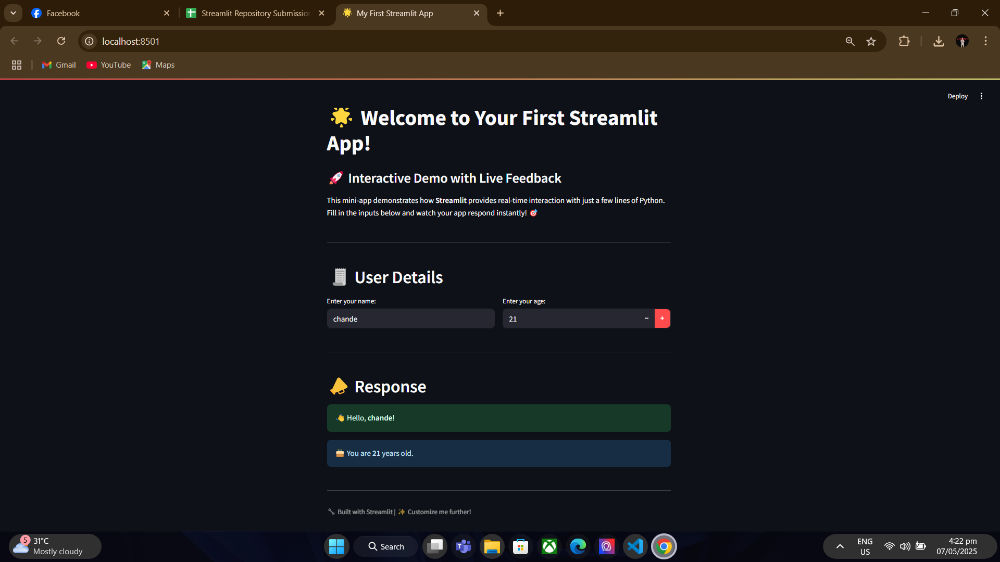

---

II. 🧾 DataFrame Viewer

Objective: Load and display CSV data interactively.

Explanation: This app allows users to upload CSV files through Streamlit's file uploader. Once uploaded, the data is loaded into a pandas DataFrame and displayed as an interactive table. The app also allows users to filter the displayed data based on specific column values. The column names are dynamically populated into a dropdown (selectbox) for easy interaction. Additionally, users can view the raw data within an expandable section. The app ensures usability by requiring the uploaded file to have at least five columns. This project demonstrates Streamlit's capability to integrate seamlessly with pandas for efficient data exploration.
- **Screenshot:**  
  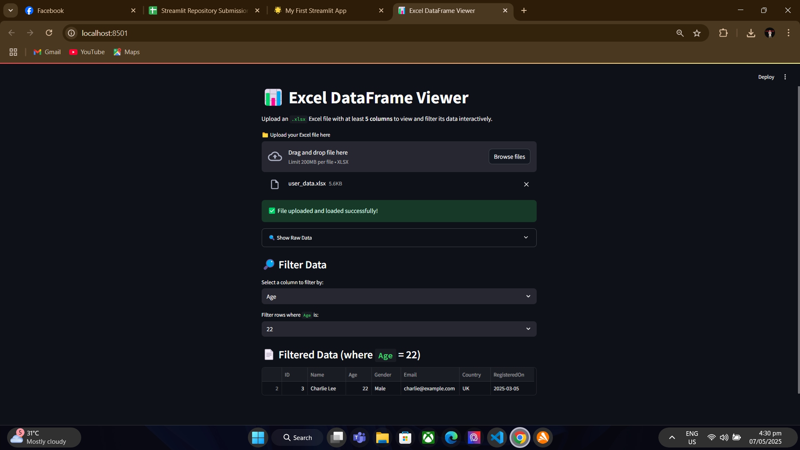
  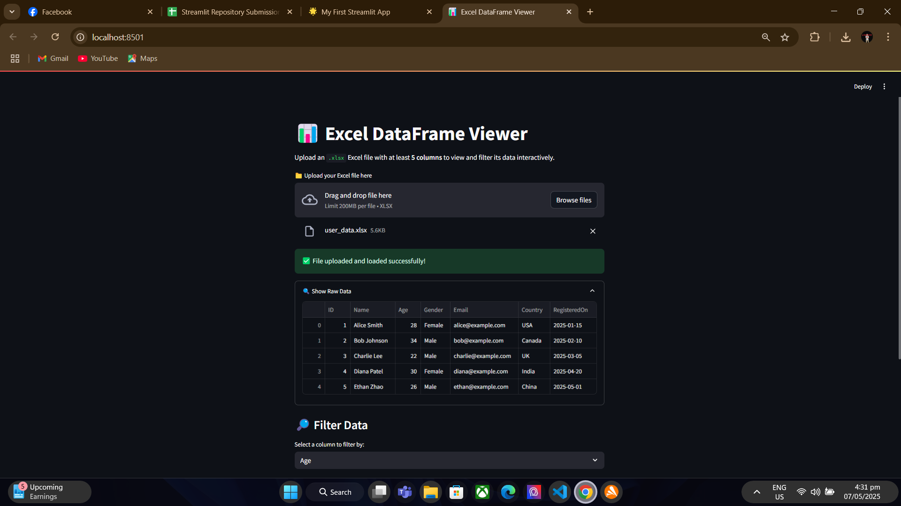

---

III. 🧩 Sidebar and Layout

Objective: Organize content using Streamlit layout components.

Explanation: This project leverages Streamlit’s layout components like the sidebar, columns, and tabs to build a structured interactive dashboard. The sidebar is used to select topics, and a slider adjusts the importance of each topic. The main content area is divided into columns to display key data warehousing and ETL process concepts. Interactive tabs provide further insights into definitions and use cases. Additionally, an expander feature lets users explore detailed information. This project emphasizes the power of Streamlit’s layout tools to create a well-organized, interactive, and informative application.
- **Screenshot:**  
  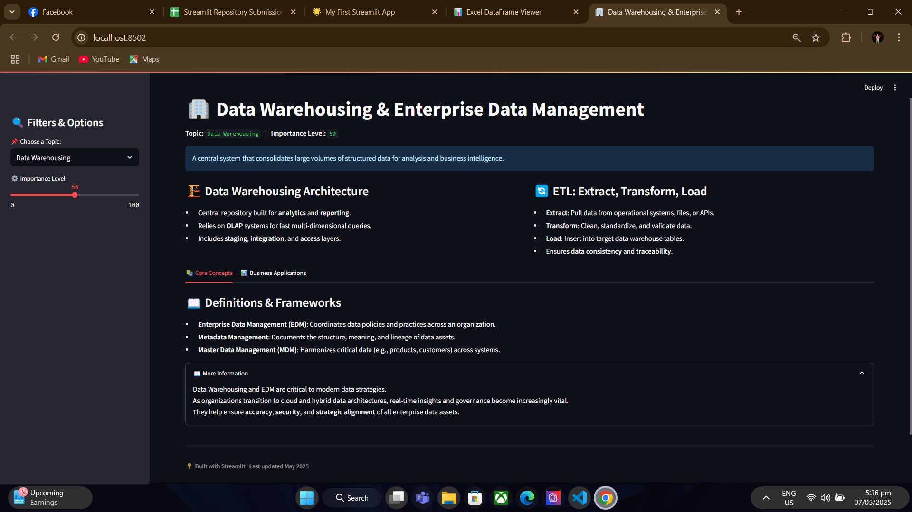
  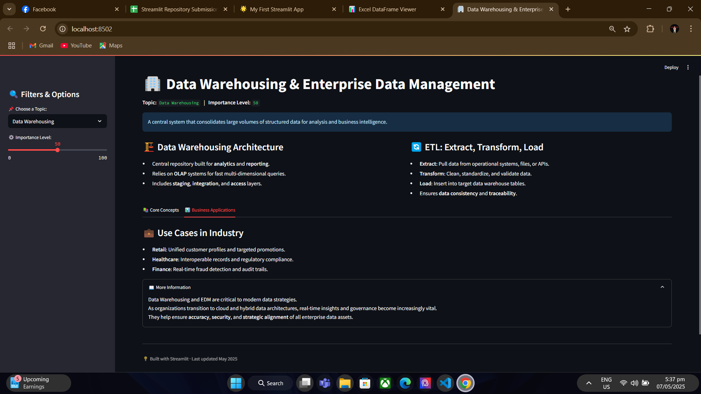
  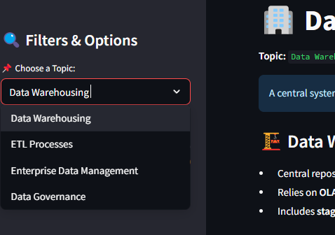

---

IV. 🌐 Fetch and Display API Data

Objective: Retrieve and visualize data from an external API.

Explanation: In this project, Streamlit is used to fetch live data from a public API, such as Open-Meteo, to retrieve real-time weather data. The JSON data is parsed and displayed through various visualizations like line charts for temperature, bar charts for precipitation, and area charts for wind speed. Other visualizations like histograms and pie charts provide insights into the distribution of humidity and weather conditions. Streamlit’s charting capabilities (st.line_chart, st.bar_chart, st.area_chart) are employed to make data exploration dynamic and informative. The app also provides options for users to inspect raw data in an expandable section for deeper analysis.
- **Screenshot:**  
  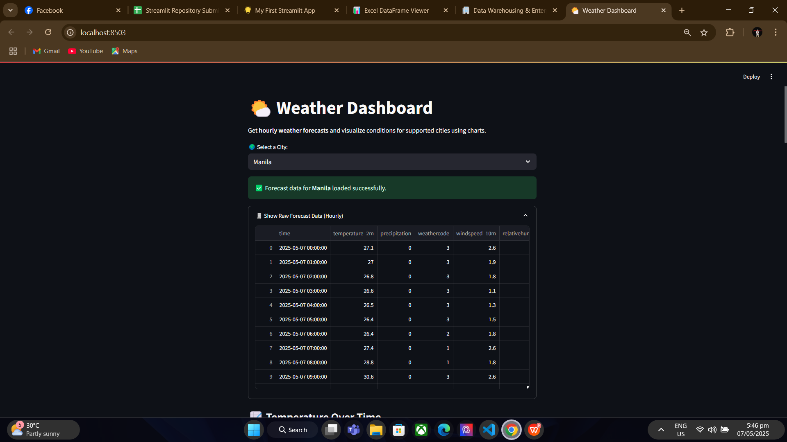
  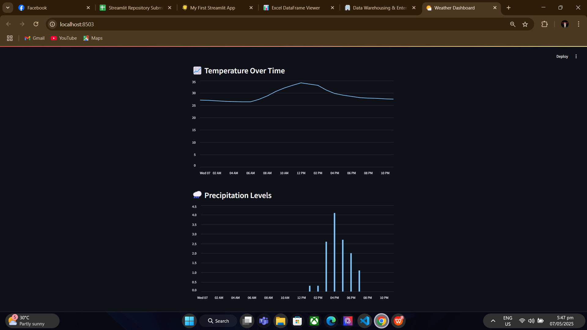
  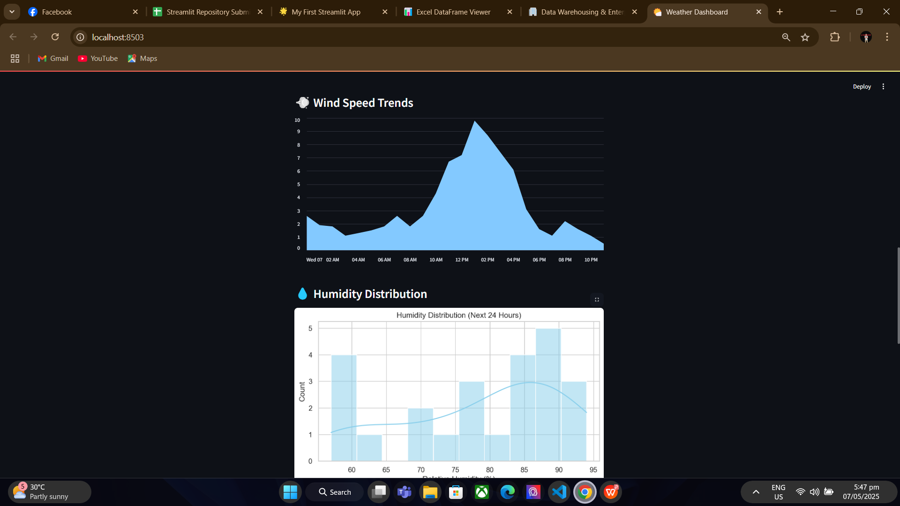
  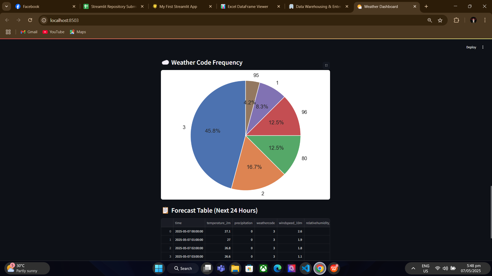
  

---

V. 🗃️ Data Pipeline with Database

Objective: Build a pipeline that inserts and retrieves data from a database.

Explanation: This app connects to a MySQL database using SQLAlchemy and allows users to retrieve and insert data. Users can view records from the database in a table format with the help of Streamlit’s st.dataframe. A form is provided to add new records to the database, with fields for name and age. Upon submission, the data is inserted into the database using a parameterized SQL query to ensure security. The app includes user authentication to limit access to authorized users only, implemented with the streamlit_authenticator library. After logging in, users can interact with the database and add new records, making this project a practical solution for securely managing data.
Key Features:
Database Connectivity: Uses SQLAlchemy to connect to MySQL, fetch data, and execute queries.
Data Display: Data fetched from the database is shown in a table format with st.dataframe.
Insert Data: A form is provided to insert new records into the MySQL database.
User Authentication: Added login functionality to restrict access to the app, fulfilling the bonus task requirement.

The combination of SQL database integration and user authentication makes this project a robust solution for securely handling and interacting with data.
- **Screenshot:**  
  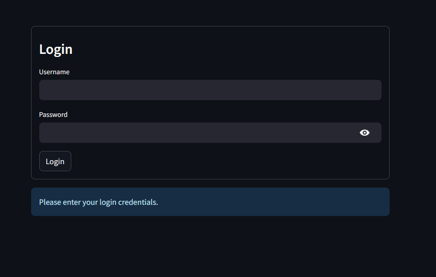
  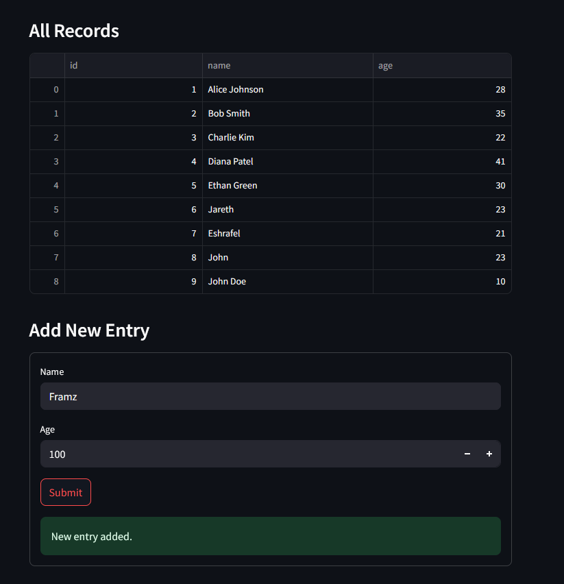

---

VI. 📹 Real-Time Video Stream with OpenCV

Objective: Display live webcam feed inside a Streamlit app.

Explanation: This activity captures real-time video from a webcam using OpenCV and applies a Gaussian Blur filter to the video stream, resulting in a smooth, stylized effect. Users can control the intensity of the effect through sliders in the sidebar that adjust parameters for spatial and range filtering. The app also allows users to capture and save snapshots of the current video frame. This project showcases Streamlit’s ability to handle real-time video streams and OpenCV integration for video processing, providing an engaging way to manipulate and capture live webcam footage.

Key Features:
Real-Time Video Capture: The webcam feed is captured in real-time.
Gaussian Blur Filter: Applied to smooth out the video feed, reducing noise and detail.
User-Controlled Filter: The sidebar slider lets the user adjust the level of the blur effect by changing the kernel size.
Snapshot Button: Users can capture and save an image of the current frame.
- **Screenshot:**  
  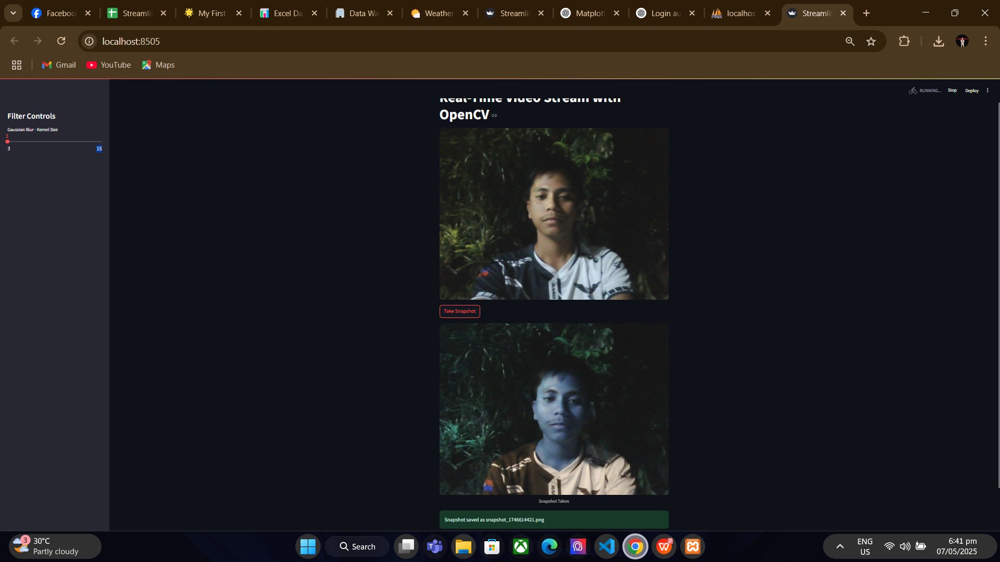
